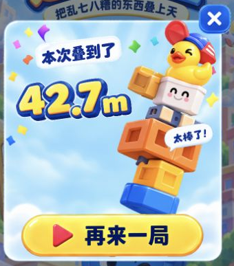
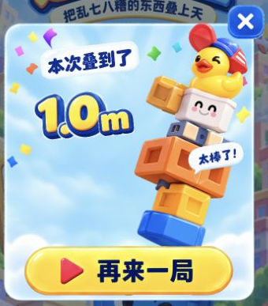

# R13 结算组件引擎接入

2026-09-13：用户在确认 R13 完整视觉稿后要求“开始下一步”。本轮已完成结算组件接入与本地 Cocos Web 自验，待用户复核引擎视觉。完整稿的确认不代表本轮运行画面已经获得用户确认。

[真实 Cocos 审阅页](http://127.0.0.1:8767/preparation/review/result-r13.html) · [已确认完整稿](../index.html)

## 最小方案与范围

沿用现有 Result 场景和表现组件，替换底板、歪塔、标题、气泡、重试、关闭以及 12 个图片字形。真实高度继续读取 `runResult.height`；不新增成绩状态或场景框架。现有数据和导航足以满足需求，无需更复杂方案。

新增的 18 张 PNG 与已批准的组件源文件逐字节一致，保留来源和 UUID 清单。没有把带 42.7m、2680、92% 的完整示意图当作游戏背景。新纪录、技术分、玩家比例、分享仍未实现，运行版不显示这些区域，因此左下部留白多于完整稿。

已有运行文件仅修改 `Result.scene`、`ResultPresentation.ts`；原 67 张 PNG/meta、其余脚本/场景、音效及配置的哈希保护检查通过。当前共 85 张 PNG、18 个 MP3、10 个 TypeScript 脚本、4 个场景。难度与物理参数、首页/HUD/设置逻辑没有变更，未推进 Batch 1B。

## 自查与修正

- 按独立组件的实际尺寸等比显示标题、歪塔、气泡、重试和关闭；不在已倾斜的标题/气泡上重复旋转。歪塔蓝色底部藏到重试按钮后方，避免悬空。
- 高度由图片字形组成，保留零值；长数字整体等比缩小，小数点及 m 可辨。已检查重复设置后旧字形清理。
- 关闭与重试的触区独立于图片，按下只缩放图片，取消或离场恢复比例。
- 首轮真实引擎发现 Creator 的字符串展开编译改变了字形拆分结果，构建通过但成绩为空。已改为 `split('')` 并通过最终运行检查；没有用静态检查替代实际显示验证。
- 对抗式代码与视觉审查未发现阻断项；最后修正重试图高度比例为读取素材 meta，避免写死比例产生约 0.46% 压扁。

## 实测证据

| 检查 | 结果与证据 |
| --- | --- |
| 编译和导入 | TypeScript exit 0；Creator 3.8.8 Web 调试构建 exit 36，日志确认成功完成；[BUILD_REPORT.json](BUILD_REPORT.json) 记录最终源码/构建哈希 |
| 完整性 | `verify_preparation.py` 通过；[当前报告](../../../review/INTEGRITY_REPORT.json)；此项只证明文件/来源/引用一致性 |
| 真成绩 | 用触摸释放首个纸箱，等待稳定得到 1.0m；通过审阅页“结束本轮”调用现有结束流程，结算显示 1.0m。不是注入样例成绩，也不是完整事故验证 |
| 导航 | 点击游戏画面中的关闭按钮返回 Home；点击重试按钮进入新 HUD，releases、placed、peakMetres 均为 0。见 [NAVIGATION.json](NAVIGATION.json)、[NAVIGATION_CHECKS.json](NAVIGATION_CHECKS.json) |
| 数字与画幅 | 0.0m、42.7m、12345.6m；375×667、300×650、450×600 的卡片、字形与触区在画面内，见 [LAYOUT_CHECKS.json](LAYOUT_CHECKS.json)。该组截图在最后重试图 1 像素源比例修正前采集，最终 375×667 截图已更新 |
| 视觉复查 | 标题、关闭完整；气泡未挡白脸；数字未碰塔；塔脚与按钮层级正确。见下方最终构建截图及前述多画幅截图 |

## 尚未证明与保留差异

独立数字有白描边接缝，动态数字组的倾角比完整稿更平缓；组件组装并非与完整稿逐像素一致。审阅页明确区分真实成绩与排版样例，样例不写入成绩。

最终运行未再记录字形异常；仍记录了一条没有工程调用栈的 `MutationObserver.observe` 错误，来源尚未确认，见 [CONSOLE.json](CONSOLE.json)。Creator 日志也保留构建结束时的子进程 SIGTERM 调试记录；不将它们描述为“所有日志零错误”。

本轮只验证指定的本地 Cocos Web 场景与动作。微信真机、声音主观体验、后台恢复和长局玩法没有重新验收；此前玩法/音频证据仍属于各自历史批次，不扩大为本轮通过。完整事故、三星、技术分、新纪录与分享不在本批范围。
